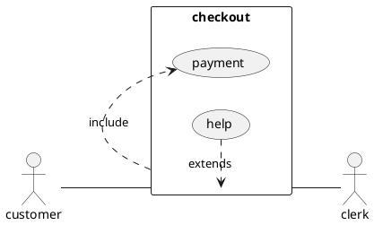

<!-- [PAGE_OPTIONS] {
    "title": "Demo-страница",
    "titleEng" : "Demo-page"
} -->
An example *file* with **Markdown** content.

# Правила определения названий страниц
По-умолчанию, имя страницы в Confluence = имени файла без расширения .md (т.е. в случае этого примера "demo")
При необходимости это название можно переопределить, добавив строку параметров PAGE_OPTIONS и указав title.
В этом случае имя страницы будет "Demo-страница".
Параметр опциональный. Его можно не указывать.


# Базовый Markdown
См. описание [здесь](https://confluence.atlassian.com/bitbucketserver/markdown-syntax-guide-776639995.html)


# Table of Contents
Для того, чтобы сгенерировать содержание, можно использовать ключевое слово `[TOC]` или `[TOC 1:6]` (с указанием уровня параграфов, которые будут индексироваться)
[TOC]


# Работа со ссылками
Реализована поддержка ссылок следующего вида:

#### Внешний линк
[Google](https://google.com) - обычная ссылка на внешний сайт

#### Внутренний линк
* [Other Page](demo.md) - при рендеринге в confluence будет заменен на страницу, ассоциированную с файлом `demo.md`
* [Other Page](/demo/demo.md) - +внутренний линк с абсолютным путем
* [На кириллице](Название%20файла%20на%20кириллице.md) - на кириллице и с пробелами

> В случае наличия пробелов, необходимо обязательно заменять их на `%20`!
>
> Все основные markdown-редакторы делают это автоматически, но если пишете руками, обращайте внимание

# Изображения и вложения
Markdown позволяет добавлять изображения и вложения на страницу, используя ссылку формата ``

Например, картинка:


Также возможно использование svg-файлов для отображения диаграмм.
Их можно редактировать напрямую через draw.io (также есть plugin draw.io для obsidian)


Или pdf-вложение: 

Или даже видос: 

> **Из важного**:
> 1. Не забывайте делать отступ после абзаца после вставки ИЗОБРАЖЕНИЯ (см. подробное описание проблемы в [Лайфхаки и часто встречающиеся проблемы](https://americor.atlassian.net/wiki/spaces/SAWSPACE/pages/3107521138))
> 2. Все вложения ОБЯЗАТЕЛЬНО должны располагаться в папке `static`. Это позволяет движку git-lfs не хранить эти файлы в репозитории, а выгружать в отдельное внешнее хранилище. Сама папка может располагаться на любом уровне иерархии, главное чтобы название всегда было именно `static`
> 3. Название ссылки внутри `[]` при этом указывать необязательно (но не запрещается)

Также (в теории) можно ссылаться на внешние ресурсы


> Но делать это нежелательно, потому что управлять этими ресурсами мы не можем и в случае чего все легко и быстро может потеряться

#### Красивые ссылки на задачи в Jira
Сервис сконфигурирован так, что если указать ссылку виде [CRM-XXXX](https://americor.atlassian.net/browse/CRM-XXXX)
то рендериться в confluence они будут вот в таком уот виде:


При этом в самой задаче появится обратная ссылка на документ, где эта задача была упомянута, что позволить быстро создавать двустороннюю связь между документацией и задачами

Чтобы это произошло важно указывать алиас для ссылки в виде CRM-XXXX, иначе работать не будет

# Include-страниц
Различают три вида include: hard, soft и excerpt.
Все виды include оформляются как ссылки на страницы с указанием префикса в названии

* `!!!` (hard)
* `@@@` (soft)
* `###` (excerpt)


___
#### Hard-include
При рендериге страницы содержимое дочернего файла публикуется как часть родительской страницы.
Если дочерний файл будет изменен в будущем, то на родительский это аффектить напрямую не будет (пока его тоже не поменяют)

*Пример*:
[!!!Included Page](tree/index.md)
___

___
#### Hard-include c фреймом в Obsidian
Для Confluence ничем не отличается от обычного hard-include с точки зрения результата.
Разница будет видна в Obsidian, в этом случае в режиме просмотра будет отображаться фрейм с просмотром дочерней страницы, а не обычная ссылка.
Чтобы включить данную фичу, нужно добавить `!` до начала ссылки.

*Пример*:

___


___
#### Hard-include со смещением
То же самое, что и обычный hard-include, но также дополнительно заголовки смещаются на указанных offset.
В примере ниже указано !!!+2, что значит что

* разделы `#` будут сконвертированы в `###`;
* разделы `##` будут сконвертированы в `####`;

*Пример*:
[!!!Included Page!!!+2](tree/index.md)
___


___
#### Hard-include раздела
При рендериге страницы выделенный раздел дочернего файла публикуется как часть родительской страницы.
Если дочерний файл будет изменен в будущем, то на родительский это аффектить напрямую не будет (пока его тоже не поменяют)

*Пример*:
[!!!##             Раздел 2          ](tree/childpage.md)
___


___
#### Hard-include раздела со смещением
То же самое, что и обычный hard-include раздела, но также дополнительно заголовки смещаются на указанных offset.

*Пример*:
[!!!## Раздел 2!!!+1](tree/childpage.md)
___


___
#### Hard-include раздела со смещением и переименованием
То же самое, что и обычный hard-include раздела, но также дополнительно заголовки смещаются на указанных offset,
а также заголовок раздела будет заменен на тот, который указан в линке.

*Пример*:
[!!!## Раздел 2!!!+1!!!Новый заголовок раздела](tree/childpage.md)
___


___
#### Soft-include
При рендериге страницы в нее вставляется confluence-plugin `include-page`.
По своей сути является фреймом.
Если дочерний файл будет изменен в будущем, то это изменение сразу же применится и к родительской.

*Пример*:
[@@@Included Page](tree/index.md)
___


___
#### Excerpt-include
При рендериге страницы в нее вставляется confluence-plugin `excerpt-page`.
По своей сути является фреймом выделенной части страницы
Если дочерний файл будет изменен в будущем, то это изменение сразу же применится и к родительской.

*Пример*:
[###CUR_EXC_NAME](tree/childpage.md)
___


# Блоки кода
```js
let a = 'a string value';

for (let char of a) {
    console.log(char);
}
```

```sql
SELECT * FROM table;
```

```
No language in this block
```

```sql
SELECT * FROM customer
```


# Графика PlantUML
Рендерится автоматически, если в блок с кодом добавить префикс `plantuml`



# Верстка таблиц
Для объединения ячеек таблиц можно использовать следующие конструкции:

* Использовать `^^` или `vv` для мержа по вертикали (указываем направление)
* Указать `||` (два подряд разделителя стоблцов) для мержа по горизонтали

|              Stage |            Direct Products | ATP Yields |
|-------------------:|---------------------------:|-----------:|
|         Glycolysis |                      2 ATP |            |
|                 ^^ |                     2 NADH |   3--5 ATP |
| Pyruvaye oxidation |                     2 NADH |      5 ATP |
|  Citric acid cycle |                      2 ATP |            |
|                 ^^ |                     6 NADH |     15 ATP |
|                 ^^ |                    2 FADH2 |      3 ATP |
|                                                  *30--32** |||


# Info-панели
Мы очень часто используем info-панели для визуального отделения текста.
В движке тоже реализована такая возможность.
Реализация следующих блоков совместима с Obsidian, можно использовать их в работе.

> [!info] Заголовок
> INFO-блок **ЖИРНЫЙ;**

> [!Success]
> SUCCESS-блок **ЖИРНЫЙ;**

> [!WARNING]
> WARNING-блок **ЖИРНЫЙ;**

> [!failure] Еще раз заголовок
> ERROR-блок **ЖИРНЫЙ;**

> [!example]
> PURPLE-блок **ЖИРНЫЙ;**

Внутри блоков возможна верстка сообщения (в примере выше - выделение текста жирным)

# Expand-виджеты
+++ [EXPAND]      Это обычный expand:
*Внутренности*
+++

+++ [EXPAND_HIDDEN] А это скрытый expand, который не попадает в hard-include:
*Внутренности скрытого экспанда*
+++

+++ [HIDDEN]  Это hidden, который будет проигнорирован при рендеринге основной страницы, а содержимое блока не будет учитываться при hard-include
*Это внутренности hidden*
+++

> [!info] Доп. инфо:
> Также для игнорирования части содержимого страницы при проведении hard-include можно использовать комментарий `<` `!-- HIDDEN_ABOVE --` `>`


# Использование HTML
Так делать можно, но очень аккуратно и осторожно. Движок по переносу в Confluence очень чувствителен к подобным трюкам и на ровном месте можно получить ошибку.
Если чего-то не хватает из реализованных возможностей, пишите Мише, будем добавлять новые фичи в движок.

Примеры:
<span style="color: rgb(255,0,0);">red text</span>

<table data-table-width="760" data-layout="default">
    <colgroup>
        <col style="width: 100px" />
        <col style="width: 600px" />
    </colgroup>
    <tbody>
        <tr>
            <th>Table Heading Cell 1</th>
            <th>Table Heading Cell 2</th>
        </tr>
        <tr>
            <td rowspan="2">Merged Cell</td>
            <td>Normal Cell 1</td>
        </tr>
        <tr>
            <td colspan="1">Normal Cell 2</td>
        </tr>
    </tbody>
</table>