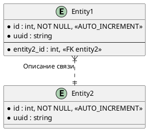

<!--
    Данный шаблон предназначен для создания артефактов в разделе
        `docs/Архитектура системы/Диаграммы ER/`

    Шаблон предназначен для описания схем БД (диаграмм),
    для разъяснения каких-либо сложных для понимания связей

    Название файла должно быть в формате `Диаграммы ER - %Entity% Env.md`,
    где Entity - название основной сущности (таблицы в БД), вокруг которой строится ERD
-->

# 🔗 Общая информация
<!-- HIDDEN_ABOVE -->

Диаграмма описывает связи у следующих сущностей:

* `Entity1`
* `Entity2`
* ...
* `EntityN`

<!--
    Далее можно в свободной форме описать все хитросплетение связей

    Пример:
    `Customer` имеет несколько ссылок на `Applicant` - PrimaryApplicant и CoApplicant
    `CustomerCreditor` связан с `CreditorGroup` тремя ссылками (одна из которых deprecated)
-->

## ✳️ Схема данных
