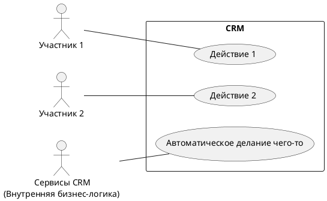
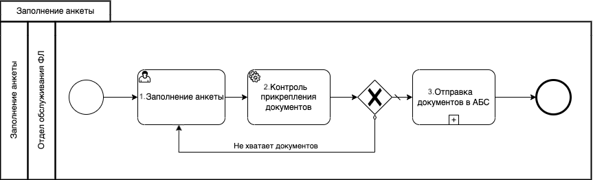
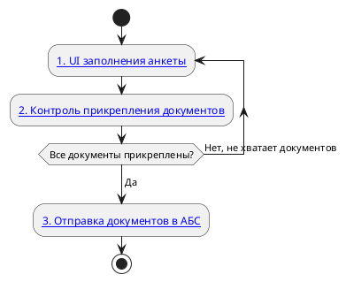
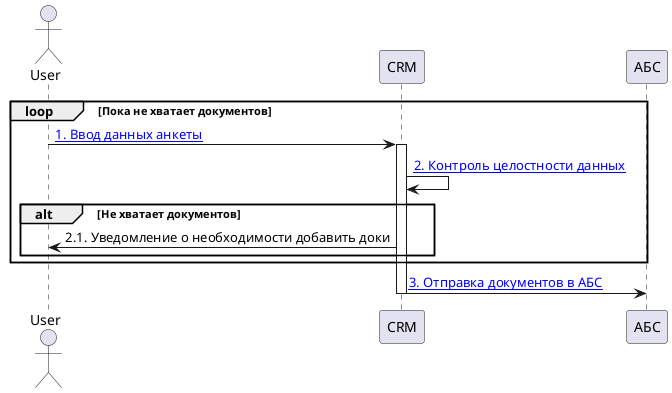
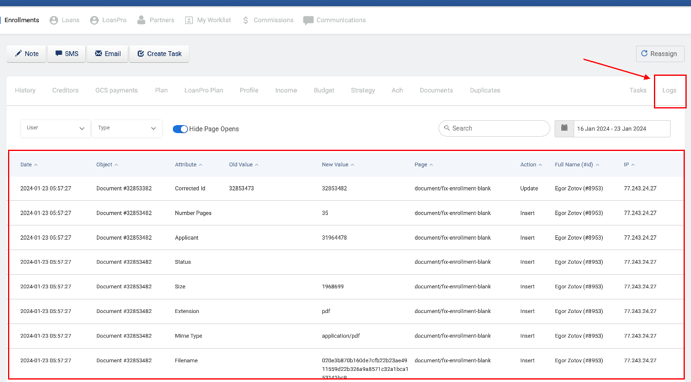

<!--
    Данный шаблон предназначен для создания артефактов в разделе
        `docs/Процессы/%Модуль%/`

    Шаблон предназначен для описания сквозных бизнес-процессов,
    которые предоставляет настоящая система для пользователей

    Название файла должно быть в формате `Процесс %Название процесса%.md`,
    где %Название процесса% - краткое название бизнес-процесса 

    Путь до артефакта зависит от компонента, в котором ведется разработка

    Если процесс сквозной и затрагивает несколько модулей, то
    * ЕСЛИ есть основной модуль, в котором реализуется большая часть функционала
        то физически необходимо разместить страницу в этом основном модуле,
        а в остальные добавить soft-include
    * ЕСЛИ процесс в равной степени затрагивает несколько модулей (>2)
        то разместить страницу в разделе common
-->

+++ [EXPAND] История изменений...
# 📜 История изменений
| **Версия**                          | **Дата**           | **Автор**                      | **Задача**                                                 | **Описание изменения** |
|-------------------------------------|--------------------|--------------------------------|------------------------------------------------------------|------------------------|
| <!--Жестких правил нумерации нет--> | <!--DD.MM.YYYY --> | <!--Last Name, First Name-->   | [CRM-XXXX](https://americor.atlassian.net/browse/CRM-XXXX) | <!--Очень кратко-->    |
| <!--1-->                            | <!--31.03.2024 --> | <!--Soldatkin Mikhail-->       | [CRM-XXXX](https://americor.atlassian.net/browse/CRM-YYYY) | <!--Initial-->         |
+++

<!-- Заполняем крупноблочно в бизнес-терминах, для всего остального есть история коммитов -->

# 🔗 Общая информация
| **Ссылки на задачи***                | **[CRM-XXXX](https://americor.atlassian.net/browse/CRM-XXXX)**                                                                  |
|--------------------------------------|---------------------------------------------------------------------------------------------------------------------------------|
| **Назначение функционала***          | <!--Пару строк о том, кто и как будет использовать данный функционал-->                                                         |
| **Терминология**                     | • **Термин 1** - описание                                                                                                       |
| ^^                                   | • **Термин 2** - описание                                                                                                       |
| **Используемые Permissions**         | • `type.group.permission1` - описание                                                                                           |
| ^^                                   | • `type.group.permission2` - описание                                                                                           |
| **Кто принимает участие в процессе** | • **Участник 1** - где участвует <!--Виды пользователей CRM, принимающих участие в процессе (классы, роли или подразделения)--> |
| ^^                                   | • **Участник 2** - где участвует                                                                                                |
| **Потенциальные будущие доработки**  | <!--Опциональный блок, Заполнить если известно-->                                                                               |
| **Информация для тестирования**      | <!--Опциональный блок, Полезная информация для работы QA-->                                                                     |

<!--
На усмотрение аналитика, из таблицы могут быть удалены разделы:
* Терминология
* Кто принимает участие в процессе
* Информация для тестирования
-->

<!-- HIDDEN_ABOVE -->
# 📋 Бизнес-требования
<!--Описание требований из задачи, переведенное на русский язык-->  
<!--На данный блок можно ссылаться из других страниц, используя excerpt-include-->

# ✳️ Детали реализации

## 1. Модель данных
### 1.1. Используемые сущности
* `%Вставить название сущности%` - [Название сущности](/templates/Шаблоны%20страниц/Шаблон%20страницы%20-%20Архитектура%20системы%20-%20Модель%20данных.md)

### 1.2. ER-диаграммы <!-- Опционально -->
Визуализация модели данных - [Название ERD](/templates/Шаблоны%20страниц/Шаблон%20страницы%20-%20Архитектура%20системы%20-%20Диаграммы%20ER.md)

### 1.3. Фикс-команды
* `%Вставить название команды%` - [Название команды](/templates/Шаблоны%20страниц/Шаблон%20страницы%20-%20Архитектура%20системы%20-%20Миграции%20данных.md)

## 2. Permissions (разрешения)
* `%Системное название permission%` - [Название permission](/templates/Шаблоны%20страниц/Шаблон%20страницы%20-%20Архитектура%20системы%20-%20Права%20доступа%20(Permissions).md)

## 3. Участники процесса <!--Опционально-->
<!--
Чаще всего эта диаграмма не будет нужна.
Тем не менее в некоторых сложных ситуациях, может быть полезно визуализировать
классы пользователей, работающих системой и указать какой функционал им доступен
-->

## 4. Описание процесса
<!--На выбор один из вариантов ниже-->

### 4.1. BPMN-описание бизнес-процесса
<!--
Схема в BPMN.
Применима для каких-то суперсложных процессов.
Стараемся поменьше использовать, т.к. в plantUML нельзя рисовать такие схемы
-->

| **Этап**                                   | **Ссылка**                                                           | **Описание функциональности** <!--ОПЦИОНАЛЬНО, МОЖНО ПИСАТЬ ПРЯМО НА СХЕМЕ СНОСКАМИ-->                                                 | **Переход** <!--ОПЦИОНАЛЬНО, ОСТАВЛЯТЬ ЕСЛИ БЕЗ ЭТОГО СЛОЖНО ПОНЯТЬ-->                     |
|--------------------------------------------|----------------------------------------------------------------------|----------------------------------------------------------------------------------------------------------------------------------------|--------------------------------------------------------------------------------------------|
| <!--№. Название как на схеме-->            |                                                                      | <!--1. Краткое описание того, что происходит на данном шаге 2. Если форма, то ссылка на UI, если сервис, то ссылка на сервис и.т.д.--> | <!--Перечень всех переходов в зависимости от условий. Каждый переход в отдельной строке--> |
| <!-- Ниже пример -->                       |                                                                      |                                                                                                                                        |                                                                                            |
| <!--1. Заполнение анкеты-->                | <!--[%Вставить название UI%](frontendExample.md)-->                  | <!--На данном этапе заполяются данные клиента, необходимые для оформления заявки клиенту.-->                                           | <!--2. Контроль прикрепления документов-->                                                 |
| <!--2. Контроль прикрепления документов--> | <!--[%Вставить название сервиса/use case/etc%](backendExample.md)--> | <!--На данном этапе бэкенд проверяет, что все прикрепленные доки в наличии.-->                                                         | <!--ЕСЛИ "Все документы в наличии" ТО "1. Заполнение анкеты"-->                            |
|                                            |                                                                      |                                                                                                                                        | <!--ЕСЛИ "Не хватает документов" ТО "3. Отправка документов в АБС"-->                      |
| <!--3. Отправка документов в АБС-->        | <!--[%Вставить название интеграции%](apiService.md)-->               | <!--На данном этапе вызывается сервис отправки доков в АБС.-->                                                                         | <!--Завершение процесса-->                                                                 |

### 4.2. Бизнес-процесс с помощью activity-диаграммы
<!--
Схема в Activity UML.
Позволяет наглядно описать довольно сложные процессы
-->

| **Этап**                                   | **Ссылка**                                                           | **Описание функциональности** <!--ОПЦИОНАЛЬНО, МОЖНО ПИСАТЬ ПРЯМО НА СХЕМЕ СНОСКАМИ-->                                                 | **Переход** <!--ОПЦИОНАЛЬНО, ОСТАВЛЯТЬ ЕСЛИ БЕЗ ЭТОГО СЛОЖНО ПОНЯТЬ-->                     |
|--------------------------------------------|----------------------------------------------------------------------|----------------------------------------------------------------------------------------------------------------------------------------|--------------------------------------------------------------------------------------------|
| <!--№. Название как на схеме-->            |                                                                      | <!--1. Краткое описание того, что происходит на данном шаге 2. Если форма, то ссылка на UI, если сервис, то ссылка на сервис и.т.д.--> | <!--Перечень всех переходов в зависимости от условий. Каждый переход в отдельной строке--> |
| <!-- Ниже пример-->                        |                                                                      |                                                                                                                                        |                                                                                            |
| <!--1. Заполнение анкеты-->                | <!--[%Вставить название UI%](frontendExample.md)-->                  | <!--На данном этапе заполяются данные клиента, необходимые для оформления заявки клиенту.-->                                           | <!--2. Контроль прикрепления документов-->                                                 |
| <!--2. Контроль прикрепления документов--> | <!--[%Вставить название сервиса/use case/etc%](backendExample.md)--> | <!--На данном этапе бэкенд проверяет, что все прикрепленные доки в наличии.-->                                                         | <!--ЕСЛИ "Все документы в наличии" ТО "1. Заполнение анкеты"-->                            |
|                                            |                                                                      |                                                                                                                                        | <!--ЕСЛИ "Не хватает документов" ТО "3. Отправка документов в АБС"-->                      |
| <!--3. Отправка документов в АБС-->        | <!--[%Вставить название интеграции%](apiService.md)-->               | <!--На данном этапе вызывается сервис отправки доков в АБС-->                                                                          | <!--Завершение процесса-->                                                                 |

### 4.3. Описание с помощью sequence-диаграммы
<!--
Sequence-диаграмма.
Удобна, если нужно сделать акцент на потоках данных
-->

| **Поток**                                  | **Ссылка**                                                           | **Описание функциональности** <!--ОБЯЗАТЕЛЬНО-->                                                                                       |
|--------------------------------------------|----------------------------------------------------------------------|----------------------------------------------------------------------------------------------------------------------------------------|
| <!--№. Название как на схеме-->            |                                                                      | <!--1. Краткое описание того, что происходит на данном шаге 2. Если форма, то ссылка на UI, если сервис, то ссылка на сервис и.т.д.--> |
| <!-- Ниже пример-->                        |                                                                      |                                                                                                                                        |
| <!--1. Заполнение анкеты-->                | <!--[%Вставить название UI%](frontendExample.md)-->                  | <!--На данном этапе заполяются данные клиента, необходимые для оформления заявки клиенту.-->                                           |
| <!--2. Контроль прикрепления документов--> | <!--[%Вставить название сервиса/use case/etc%](backendExample.md)--> | <!--На данном этапе бэкенд проверяет, что все прикрепленные доки в наличии. Описание проверки--->                                      |
| <!--3. Отправка документов в АБС-->        | <!--[%Вставить название интеграции%](apiService.md)-->               | <!--На данном этапе вызывается сервис отправки доков в АБС-->                                                                          |

### 4.4. Сценарии использования
<!--
Сценарии использования.
Если используется сложная бизнес-логика,
и есть необходимость ее коротко и емко отобразить,
то можно описать ее в формате Use Cases (без использования диаграмм)
-->

#### 4.4.1. <!--Сценарий 1-->
| **Название сценария** | **Сценарий 1**                                             |
|-----------------------|------------------------------------------------------------|
| Краткое описание      | <!--Краткое описание того, что тут происходит-->           |
| Субъекты              | <!--Участник 1-->                                          |
| Результат             | <!--Что получается на выходе данного сценария-->           |
| Постусловия           | <!--Если нужно что-то сделать после завершения сценария--> |

##### 4.4.1.1. Основной поток
<!--1. Клиент заполняет анкету, используя [%Вставить название UI%](frontendExample.md)-->
<!--2. CRM проверяет, что прикреплены всех необходимых документы с помощью [%Вставить название сервиса/use case/etc%](backendExample.md)-->
<!--3. CRM отправляет документы в АБС [%Вставить название интеграции%](apiService.md)-->

##### 4.4.1.2. Альтернативный поток 1 <!--При наличии-->
<!--1. Клиент заполняет анкету, используя [%Вставить название UI%](frontendExample.md)-->
<!--2. CRM при проверке [%Вставить название сервиса/use case/etc%](backendExample.md) обнаружила недостающие документы-->
<!--3. CRM возвращает поток к п.1.-->

##### 4.4.1.N. Альтернативный поток N <!--При наличии-->

## 5. Нефункциональные требования <!--ЕСЛИ ПРИМЕНИМО-->
<!--
    ЕСЛИ ВЫ ВДРУГ ПРОДУМАЛИ И ОПИСАЛИ КАКОЕ-ТО НОВОЕ НФТ, КОТОРОЕ ПОТЕНЦИАЛЬНО
    МОЖЕТ БЫТЬ ПЕРЕИСПОЛЬЗУЕМЫМ, ДАВАЙТЕ ДОБАВЛЯТЬ В ШАБЛОН.
    Например: "5.1. Требования к логированию изменений" можно от проекта к проекту
    Копипастить без изменений. Ощущение, что много чего можно будет оформить в таком же виде
-->

### 5.1. Требования к логированию изменений
Любое изменение `%entity_name%` (как автоматическое, так и вручную через UI) должно сохраняться в таблицу log и далее
отображаться в разделе [Logs Enrollment](https://test.americor.biz/deals/logs?id=31574904) по каждому из клиентов

### 5.2. История изменений <!--При наличии-->
...

### 5.3. Прочие требования <!--При наличии-->
...
