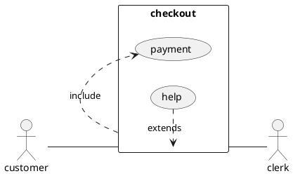

<!--
    Данный шаблон предназначен для создания артефактов в разделе
        `docs/frontend/%path%/%name%.md`

    Шаблон предназначен для описания UI,
    которые предоставляет настоящая система для пользователей

    Название файла должно быть в формате `%name%.md`,
    где %name% - название экранной формы/интерфейса

    Путь до артефакта '%path%' зависит от следующего:

    Путь до артефакта зависит от %path% - пути, который пользователь
    должен пройти, чтобы открыть данный UI
    А именно последовательность открытия вкладок, разделов и всплывающих окон
-->

+++ [EXPAND] История изменений...
# 📜 История изменений
| **Версия**                          | **Дата**           | **Автор**                      | **Задача**                                                 | **Описание изменения** |
|-------------------------------------|--------------------|--------------------------------|------------------------------------------------------------|------------------------|
| <!--Жестких правил нумерации нет--> | <!--DD.MM.YYYY --> | <!--Last Name, First Name-->   | [CRM-XXXX](https://americor.atlassian.net/browse/CRM-XXXX) | <!--Очень кратко-->    |
| <!--1-->                            | <!--31.03.2024 --> | <!--Soldatkin Mikhail-->       | [CRM-XXXX](https://americor.atlassian.net/browse/CRM-YYYY) | <!--Initial-->         |
+++

<!-- Заполняем крупноблочно в бизнес-терминах, для всего остального есть история коммитов -->


# 🔗 Общая информация
| **Ссылки на задачи***                | [CRM-XXXX](https://americor.atlassian.net/browse/CRM-XXXX)                                                                      |
|--------------------------------------|---------------------------------------------------------------------------------------------------------------------------------|
| **Назначение функционала***          | <!--Пару строк о том, кто и как будет использовать данный функционал-->                                                         |
| **Терминология**                     | • **Термин 1** - описание                                                                                                       |
| ^^                                   | • **Термин 2** - описание                                                                                                       |
| **Используемые Permissions**         | • `type.group.permission1` - описание                                                                                           |
| ^^                                   | • `type.group.permission2` - описание                                                                                           |
| **Кто принимает участие в процессе** | • **Участник 1** - где участвует <!--Виды пользователей CRM, принимающих участие в процессе (классы, роли или подразделения)--> |
| ^^                                   | • **Участник 2** - где участвует                                                                                                |
| **Потенциальные будущие доработки**  | <!--Опциональный блок, Заполнить если известно-->                                                                               |
| **Информация для тестирования**      | <!--Опциональный блок, Полезная информация для работы QA-->                                                                     |

<!--
На усмотрение аналитика, из таблицы могут быть удалены разделы:
* Терминология
* Кто принимает участие в процессе
* Информация для тестирования
-->


# 📋 Бизнес-требования
<!--Описание требований из задачи, переведенное на русский язык-->  
<!--Чтобы не писать по много раз одно и то же, можно воспользоваться excerpt-include и сослаться на БТ из описания процесса-->
[!!!# 📋 Бизнес-требования](Шаблон%20страницы%20-%20Процессы.md)


# ✳️ Детали реализации
<!-- HIDDEN_ABOVE -->

## 1. Сценарии использования <!--Опционально-->
<!--
Если используется сложная бизнес-логика,
и есть необходимость ее коротко и емко отобразить,
то можно описать ее в формате Use Cases.
-->

### 1.1. Use Case диаграмма <!--Опционально-->
<!--
Чаще всего эта диаграмма не будет нужна.
Тем не менее в некоторых сложных ситуациях, может быть полезно визуализировать
классы пользователей, работающих системой и указать какой функционал им доступен
-->



## 2. UI %для того-то и того-то% <!--Обязательный раздел-->
<!--
Добавляем мокапы, описывающие данный UI
Каждый функциональный элемент UI должен сопровождаться скриншотами,
на которых ключевые элементы пронумерованы.
Если реализуется сложная логика разграничения прав доступа (согласно ролевой модели),
эти правила также необходимо отразить на мокапе.
Блок с макетами интерфейсов обязательный.
-->


### 2.1. Условия отображения <!--Обязательный раздел-->
Если пользователю доступно право `%deals.group.permissionName%`, то у него в интерфейсе %название интерфейса% (
[https://{host}/deeplink?id={id}](https://test.americor.biz/deeplink?id=123456))
появляется/доступна %описание функциональности%

### 2.2. Правила рендеринга <!--Обязательный раздел-->
<!--
Каждый функциональный элемент UI должен быть определен строго в таком формате.
При необходимости допустимо добавлять новые столбцы в эту таблицу
* (например вынести в отдельную колонку правила отображения/валидации,
    если они сложные и тяжелые)
* Вынести в отдельную колонку тексты ошибок валидации
* Выносить сложную/объемную логику в отдельные параграфы(разделы)
    и ссылаться из таблицы на них
-->

| **Элемент**                      | **Бизнес-логика**                                                                                                                                                                                                                         |
|----------------------------------|-------------------------------------------------------------------------------------------------------------------------------------------------------------------------------------------------------------------------------------------|
| <!--1. Кнопка **"Название"**-->  | <!--Описываются правила отображения, формирования значений по данным БД, валидации, поведения при определенных действиях пользователя и.т.д. По нажатию на кнопку происходит [1.3.1. Функционал: %Название%](#131-функционал-название)--> |
| <!--2. Таблица **"Название"**--> | <!--Логику больших и сложных элементы допустимо выносить в отдельный подраздел c добавлением ссылки: Описание таблицы см. в разделе [1.2.1. Таблица: "Название"](#121-таблица-название)-->                                                |
| <!--3. Поле **"Название"**-->    |                                                                                                                                                                                                                                           |

#### 2.2.1. Таблица: "%Название%" <!--Если есть таблицы, то обязательный раздел-->
<!--Детальную информацию о правилах отображения таблиц описывать строго в таком формате-->

##### 2.2.1.1. Источник данных <!--Если есть таблицы, то обязательный раздел-->
```sql
Реальный select или псевдокод
```

##### 2.2.1.2. Набор столбцов <!--Если есть таблицы, то обязательный раздел-->
<!--
При необходимости допустимо добавлять новые столбцы в эту таблицу
Например, "Комментарий" - любая полезная информация для разработки
-->

| **Название**                       | **Связь с Моделью Данных (БД или AR)**                                                   |
|------------------------------------|------------------------------------------------------------------------------------------|
| %Отображаемое название колонки 1%⇅ | <!--`entity.attribute`-->                                                                |
| %Отображаемое название колонки 2%⇅ | <!--а) Найти объект `Entity1` по `Entity.attribute` б) Отобразить `Entity1.attribute`--> |
> символом **`⇅`** - помечены поля, для которых должна быть включена возможность сортировки

#### 2.2.2. Иные сложные элементы (помимо таблиц)
<!--
Формат не определен, пока произвольный

TBD: Позже описать шаблон для следующих элементов
* Фильтры
* Строка - поиска 
* Прочие часто используемые элементы
-->


### 2.3. Функционал <!--Обязательный как раздел и структура параграфов до 3-го уровня-->
#### 2.3.1. Функционал: %Название%
<!--
Внутренности раздела - просто рекомендация,
по ситуации можно следовать своим предпочтениями и описать в том формате,
который подойдет к конкретной ситуации.
-->


##### 2.3.1.1. Условия доступности
Если пользователю доступно право `%deals.group.permissionName%`, то пользователю доступен функционал %краткое описание
функционала%

##### 2.3.1.2. Описание функционала
<!--
Таблицу можно прерывать на более подробное описание, функционала, 
ниже пример добавления новой записи в таблицу
-->

| **Функционал**                           | **Скриншот** |
|------------------------------------------|--------------|
| <!--Описание в формате событие/отклик--> |              |

У вновь добавляемой строки доступны для редактирования следующие поля:

| **Поле**              | **Тип поля**                                              | Связь с БД                | Поведение                                            |
|-----------------------|-----------------------------------------------------------|---------------------------|------------------------------------------------------|
| <!--Название поля*--> | <!--Поле ввода даты/cуммы/Раскрывающийся список и.т.д.--> | <!--`entity.attribute`--> | <!--Описание логики заполнения, валидации, и.т.д.--> |
> звездочкой **`*`** - помечены обязательные поля

Остальные поля недоступны для редактирования и заполняются системой автоматически в момент сохранения записи

| **Поле в БД**             | **Правила заполнения**             |
|---------------------------|------------------------------------|
| <!--`entiry.attribute`--> | <!--Описание правила заполнения--> |

| **Функционал**                                                   | **Скриншот**                    |
|------------------------------------------------------------------|---------------------------------|
| <!--Продолжение описания функционала в формате событие/отклик--> |  |


#### 2.3.N. Функционал: %Название%
...

## 3. UI %для того-то и того-то% <!--Обязательный раздел-->
...